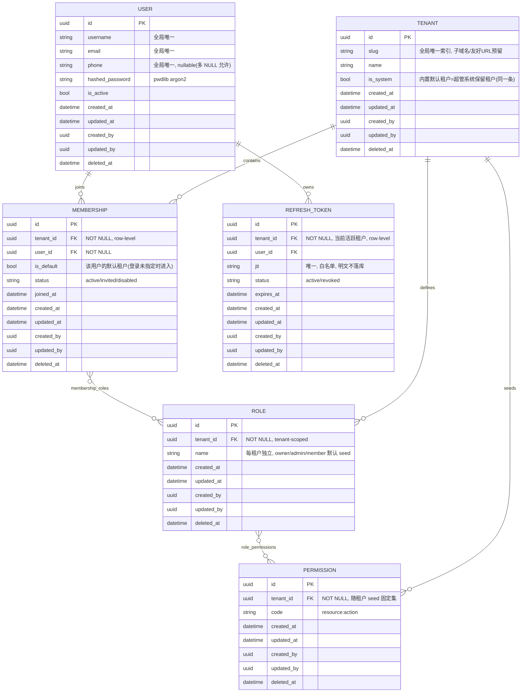
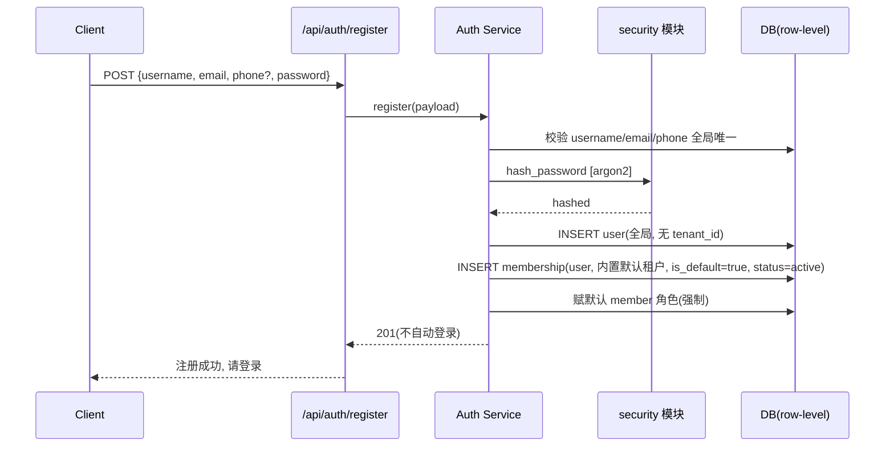
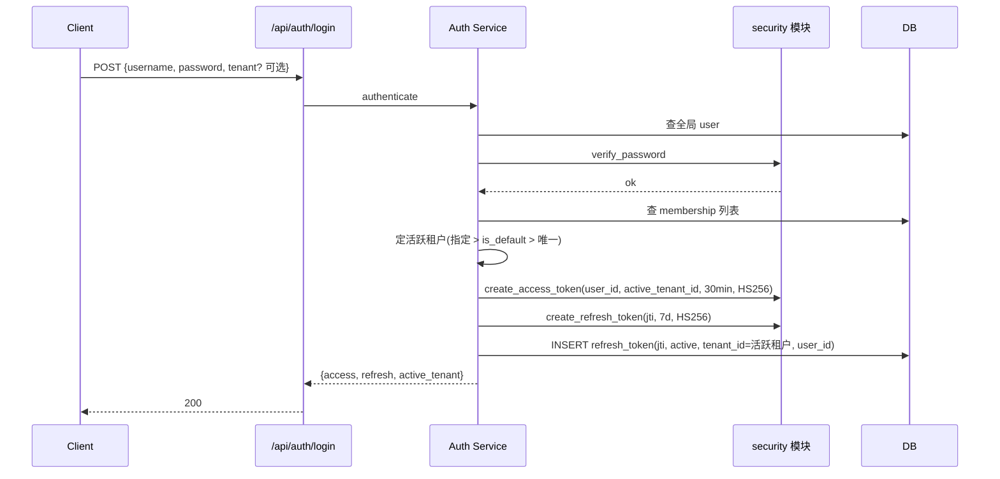
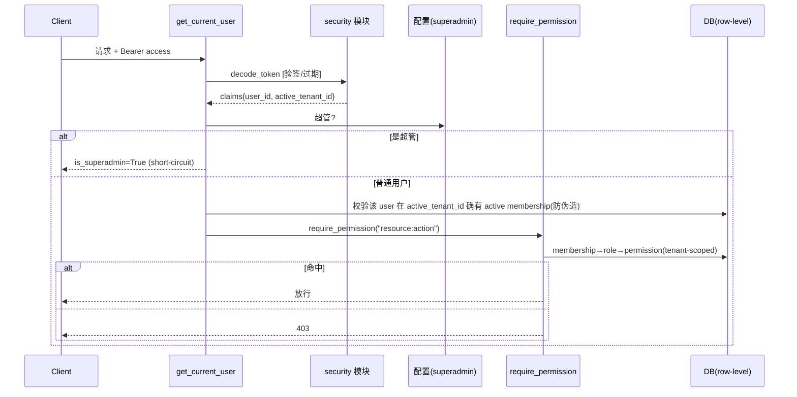

# BoxBase v1.0 Week 2 — 认证 / 多租户 / RBAC 架构设计评审

- **文档状态**：评审稿（Day 1 产出，待 Day 2+ 落地）
- **任务标签**：Week 2 Day 1（架构评审，不写代码）
- **日期**：2026-05-30
- **基线 commit**：dadf307（Week 1 全部闭环，CI Run #14 全绿，tag week1-complete @ 07ee750）
- **产品经理**：baihw（GitHub: HarveyBai） / **顾问**：会话内 AI
- **远端**：git@github.com:HarveyBai/box-base.git
- **决策状态**：A/B/C 三档（D1–D10）+ ER 细化（Q1–Q5、Q-A~Q-E、slug、全局用户模型、审计字段、部门归位）全部拍板

> 命名说明：采用 Week 1 Day 5 新立的"日期+任务主题"归档命名规约；"Week 2 Day 1"仅作任务追踪标签。

---

## 章节 1：Scope 与目标

### 1.1 Week 2 交付什么

- 用户认证体系：注册、登录、登出、refresh 换发（rotation）、多租户切换，全部挂 `/api` 前缀。
- 全局用户模型：User 全局唯一（username/email/phone 单列唯一），经 `membership` 加入多个租户；token 带"当前活跃 tenant_id"。
- 多租户隔离：Row-level（共享库共享表 + `tenant_id`），ORM 强制租户过滤。
- RBAC：简化三表（Role / Permission + 角色挂 membership），权限串 `resource:action`，tenant-scoped。
- 超级管理员：配置文件注入 superadmin username，short-circuit 绕过 tenant 过滤与 RBAC。
- 会话管理：refresh 存库可撤销（jti 白名单 + rotation），强制下线 / 按设备登出。
- 迁移：Day 2 引入 Alembic + baseline。
- 质量门禁：pytest-cov 分层覆盖率（全局 ≥80% / 安全核心 ≥95%），Week 2 内落 CI 强制。
- 统一审计基类：Mixin 注入 created_at/updated_at/created_by/updated_by/deleted_at，软删除与 ORM 过滤联动。

### 1.2 Week 2 明确不交付（划清边界）

- 第三方 OAuth / 社交登录（延后，届时单独引 authlib）。
- 企业级 SSO（SAML/OIDC IdP）、SCIM、目录同步——非 v1.0。
- PostgreSQL RLS——Week 2 不启用，ORM 预留 hook。
- access token 即时吊销——不实现，升级路径预留（章节 8）。
- ABAC / 五表细粒度 RBAC / 对象级所有权进 RBAC 表——不做。
- **​【本轮更新】部门 / 分组（group）结构——v1.0 完全不带**（不建表、User/membership 均不加字段）；作为"按需扩展点"记录，未来方向为通用 group（见 2.3）。
- 完整多租户切换 UI——v1.0 仅提供 `/api/auth/switch-tenant` 最小端点。
- 完整 admin 后台 UI——仅最小 `/api/admin/*` API。

### 1.3 与 Week 3 的接口预期

- Week 2 交付"当前用户 + 当前活跃租户 + 权限校验"依赖（`get_current_user` / tenant context / `require_permission`），Week 3 复用。
- ORM 强制 tenant + 软删除过滤为 Week 3 所有业务表隔离基线。
- 对象级所有权（含未来"同部门/同 group 读"）由 Week 3 service 层实现；Week 2 提供 `created_by` 约定与三层分层规范，不替其实现。

---

## 章节 2：核心库选型评审

> 联网核实纪律：版本号均为 2026-05-30 实际抓取自 PyPI / GitHub Releases 的字符串。

### 决策点 2.1：认证库 — ✅ DIY 薄层（pyjwt + pwdlib + FastAPI 原生依赖注入）

| 候选 | Latest Release（核实） | 维护状态 | 质量 | 性能 | 依赖 | 可更换 |
|---|---|---|---|---|---|---|
| fastapi-users | `fastapi_users-15.0.5`（2026-03-27） | ⚠️ **官方维护模式**，不再加新功能 | 高但封顶 | 好 | 中 | 差 |
| authx | `authx 1.6.0`（2026-04-30） | **4 - Beta**，单人主导 | 中 | 好 | 中 | 差-中 |
| **DIY 薄层** | pyjwt `>=2.12.0`、pwdlib | 稳定小库 | 高 | **最佳** | **最小** | **最佳** |

**核实要点**：fastapi-users 15.0.5 PyPI 标注维护模式，其依赖即 `pyjwt[crypto] >=2.12.0` + `pwdlib[argon2,bcrypt]`；authx 1.6.0 为 "4 - Beta"；横评见 WorkOS 2026 文。

**推荐方向**：四判据下 DIY 后三项最优；架构高度自主，现成库需迁就抽象。安全不打折（哈希 pwdlib argon2 / JWT pyjwt，均 fastapi-users 同款）。封装独立 `security` 模块，薄纯可单测可整体替换。fastapi-users/authx 作为候选完整保留附证据。

### 决策点 2.2：多租户隔离策略 — ✅ Row-level + tenant_id

理由：轻量定位；SQLite/PG 一致性纪律；跨租户查询高频；独立部署逃生通道。代价：靠代码纪律 → ORM 强制过滤；PG RLS 第二防线 Week 2 不启用、预留 hook。（候选对比同前版，Schema/DB/Hybrid 因 SQLite 无 schema、运维成本等被否。）

### 决策点 2.3：RBAC 粒度 — ✅ 简化三表 + `resource:action`

- 三表：Role / Permission + 角色经 membership 关联；权限串 `resource:action`；seed 固定。
- **三层访问控制模型（能力边界）​**：① 租户隔离（ORM 注入 tenant_id）② RBAC（角色能否调操作）③ 对象级/关系级（service 层）。
- **​【本轮更新】部门 / 分组归位**：部门是**租户内的组织单元**，归属挂 **membership 层**，绝不挂全局 User。v1.0 **不实现**；作为第 3 层（关系级授权，如"同部门/同 group 读"）的按需扩展点。**未来方向：通用 group 方案**——`group` 表（tenant-scoped）+ `membership_groups` 多对多，一个成员可属多个分组，可同时覆盖"部门 / 项目组 / 标签"及"同 group 读"需求，优于单一 department 单归属。届时为 membership 之下的干净增量，不影响现有结构。

---

## 章节 3：数据模型 ER 设计

> 全局用户模型：User 不属租户，经 `membership` 加入多租户；角色挂 membership。所有业务表继承审计 Mixin。**部门/分组 v1.0 不建模**（归位说明见 2.3）。评审稿草图，字段 Day 2 细化。

**表职责与设计取舍**：
- **USER（全局实体）​**：username/email/phone **各自单列全局唯一索引**（phone nullable，唯一索引允许多 NULL）；不带 tenant_id；**不带 department_id（已移除，部门是租户内概念见 2.3）​**。
- **TENANT**：`slug` 全局唯一索引（子域名/友好 URL 预留，v1.0 不强依赖路由）；`is_system=true` 的那条**同时是**内置默认租户（注册默认加入）与超管系统保留租户（Q-A 合并为一条）。
- **MEMBERSHIP（核心关联表）​**：用户↔租户多对多 + 租户内身份载体；带 tenant_id 走 row-level；`is_default` 标记默认租户（Q-E）；`status` 支持邀请/停用。索引：`(tenant_id, user_id)` 唯一、`user_id`、`(user_id, is_default)`（查默认租户）。
- **ROLE / PERMISSION**：tenant-scoped，随租户 seed；角色经 `membership_roles` 关联 membership。membership 创建时**强制赋默认 member 角色**（Q-B）。索引：`(tenant_id, name)`、`(tenant_id, code)`。
- **REFRESH_TOKEN**：tenant_id = 签发时活跃租户；jti 唯一索引；rotation 时旧 jti→revoked。索引：`jti` 唯一、`(tenant_id, user_id)`、`expires_at`。
- **关联表** `membership_roles` / `role_permissions`：带 tenant_id（Q2），继承审计 Mixin。

**统一审计 Mixin（所有业务表继承）​**：
- `created_at`（默认 now）、`updated_at`（onupdate now）。
- `created_by` / `updated_by`（UUID nullable，service 层写当前 user_id；seed 可空）。
- `deleted_at`（软删除时间戳，null=未删），**与 ORM 默认过滤联动**（自动加 `deleted_at IS NULL`）。

**待 Day 2 细化**：phone 唯一索引在 SQLite/PG 对多 NULL 行为核对；membership 唯一约束最终形态；is_default 每用户至多一条 active 的约束实现方式。

---

## 章节 4：认证流程时序图

### 4.1 注册（全局用户 + 默认加入内置租户，强制默认 member，不自动登录）

### 4.2 登录（定活跃租户：指定/default/唯一 → 签发双 token + refresh 落库）

### 4.3 权限校验（解析 token → 超管 short-circuit → 校验活跃 membership + RBAC）

> refresh rotation：`/api/auth/refresh` 验签 → 查 jti active → 旧 jti→revoked + 新 refresh(新 jti) + 新 access。logout：当前 jti→revoked。切换租户：`/api/auth/switch-tenant` 校验目标 membership 存在且 active → 以新 active_tenant_id 重签 token（旧 refresh 可按 rotation 失效）。

---

## 章节 5：API 端点初稿

| 路径 | 方法 | 简述 | 权限 | 优先级 |
|---|---|---|---|---|
| /api/auth/register | POST | 注册（全局用户+默认租户+默认 member） | 公开 | P0 |
| /api/auth/login | POST | 登录，定活跃租户，签双 token | 公开 | P0 |
| /api/auth/refresh | POST | refresh 换发（rotation） | 有效 refresh | P0 |
| /api/auth/logout | POST | 吊销当前 refresh | self | P0 |
| /api/auth/switch-tenant | POST | 切换活跃租户，重签 token | self + 目标 membership | P2 |
| /api/auth/tenants | GET | 我加入的租户列表 | self | P1 |
| /api/users/me | GET | 当前用户信息 | self | P0 |
| /api/users | GET | 列出当前租户成员 | `user:read` | P1 |
| /api/users | POST | 邀请用户加入当前租户 | `user:write` | P1 |
| /api/memberships/{id} | PATCH | 改成员状态/角色 | `user:write` | P1 |
| /api/memberships/{id} | DELETE | 移出租户（软删 membership） | `user:write` | P2 |
| /api/roles | GET | 列当前租户角色 | `role:read` | P1 |
| /api/roles | POST | 创建角色 | `role:write` | P1 |
| /api/roles/{id}/permissions | PUT | 角色分配权限 | `role:assign` | P1 |
| /api/permissions | GET | 列 seed 权限集 | `role:read` | P2 |
| /api/admin/tenants | GET | 跨租户列租户 | superadmin | P1 |
| /api/admin/users | GET | 跨租户查用户 | superadmin | P2 |

> ≥17 端点，覆盖 auth/users/memberships/roles/permissions/admin。`/api/admin/*` 走超管 short-circuit。

---

## 章节 6：测试策略

- **单元**：security（hash/verify、签发/解码/过期/篡改、rotation）≥95%；service（注册全局唯一+默认 membership+默认 member、登录定活跃租户、switch-tenant、refresh rotation、logout）；RBAC（命中/不命中、超管 short-circuit）≥95%。
- **集成**：各端点 happy path + 401/403；超管/普通两分支；多 membership 用户登录进 default、显式切换。
- **安全场景**：跨租户访问被挡；token 篡改（含改 active_tenant_id 进未加入租户）必败——校验须核对 active membership；logout/rotation 后旧 refresh 失效；超管能跨租户、普通用户绝不进 `/api/admin/*`；全局唯一（重复 username/email/phone 被拒）；phone 多 NULL 允许；argon2 正确性。
- **三层访问控制**：隔离/RBAC/对象级各独立用例不串层。
- **软删除**：`deleted_at` 数据默认不可见。
- **覆盖率（D9）​**：pytest-cov，CI `--cov-fail-under=80`，security/RBAC ≥95%。**Day 1 仅记录，不装依赖、不改 CI**。

---

## 章节 7：迁移与依赖

> Day 1 不装任何依赖；以下为 Day 2 清单。

- **Alembic（D8）​**：Day 2 首件，空 baseline 再写表；env.py 读 config；autogenerate 识别 tenant_id；SQLite/PG 双跑。
- **哈希（D5）​**：`pwdlib[argon2]`。
- **JWT（D6）​**：`pyjwt[crypto]`（核实 fastapi-users 15.0.5 依赖 `>=2.12.0`）；**HS256**，RS256 延后。
- **覆盖率**：`pytest-cov`。
- **整合**：纳入 `backend/pyproject.toml`（uv，Python 3.12），Day 2 安装，遵循"版本变更先报备"。

---

## 章节 8：风险与未决问题

### 8.1 已识别技术风险（概率×影响）

1. **Row-level/软删除漏过滤致泄露**（高×高）→ ORM 强制 tenant + deleted_at 过滤；安全测试专项。
2. **access token 即时吊销缺口**（中×中）→ 接受 ≤30min 窗口；升级路径预留（jti 复用 + get_current_user 单点增查 + access 带 session jti），可加 Redis。
3. **活跃租户上下文越权**（中×高）→ active_tenant_id 在签名 token 内；校验必核对该 user 在该租户有 active membership，防伪造 token 进未加入租户。
4. **超管标识泄露/滥用**（低×高）→ superadmin username 走配置（SECRETS.md 隔离），short-circuit 集中单点易审计。
5. **SQLite/PG 迁移差异**（中×中）→ Alembic 双环境跑测；注意 phone 多 NULL 唯一索引差异。
6. **refresh 被盗（无 RLS）​**（中×中）→ 存库可撤销 + rotation + 7 天有效期 + 强制下线。

### 8.2 已识别扩展点（v1.0 不实现，记录在案）

- **部门/分组（group）​**：租户内组织单元，归位 membership 层；未来方向 = 通用 `group`(tenant-scoped) + `membership_groups` 多对多，覆盖部门/项目组/标签及"同 group 读"；为 membership 下干净增量。
- **PostgreSQL RLS** 第二防线；**access token 即时吊销**；**ABAC / 五表 RBAC**。

### 8.3 待 Day 2 复核

- 系统保留租户与内置默认租户已合并为一条（Q-A）；seed 时确保该条 `is_system=true` 唯一存在。
- `is_default` membership 每用户至多一条 active 的约束实现（部分唯一索引 vs 应用层保证）。
- switch-tenant 是否在切换时 rotation 旧 refresh（倾向是，统一会话语义）。

---

## 章节 9：Day 2 待办预案（30 分钟级，待拍板后启动）

1. Alembic：装包、配 env.py（读 config）、空 baseline。（~30min）
2. 审计 Mixin + USER（username/email/phone 单列唯一）+ TENANT（slug 唯一、is_system）+ 首迁移。（~45min）
3. MEMBERSHIP（唯一 (tenant_id,user_id)、is_default、status）+ 迁移。（~30min）
4. ROLE/PERMISSION/membership_roles/role_permissions（tenant-scoped）+ 迁移。（~45min）
5. REFRESH_TOKEN（jti 白名单）+ 迁移。（~30min）
6. ORM 强制过滤（tenant + deleted_at）+ 请求上下文（is_superadmin、active_tenant_id）。（~60min）
7. security 模块：hash/verify、create/decode access+refresh、rotation、get_current_user（含 active membership 校验）。（~60min）
8. seed：合并的系统/默认租户 + superadmin 引导 + 每租户默认角色/权限 + 注册默认 member。（~45min）
9. pytest-cov + security 首批单测（全局唯一、活跃租户校验、rotation）。（~45min）

> 遵循 ER 依赖顺序；每切片 STOP 点交验收。

---

## 章节 10：References

- FastAPI Users — PyPI（维护模式，v15.0.5）：<https://pypi.org/project/fastapi-users/>
- FastAPI Users — GitHub Releases（v15.0.5 依赖 pyjwt[crypto] >=2.12.0）：<https://github.com/fastapi-users/fastapi-users/releases>
- AuthX — PyPI（v1.6.0，4 - Beta）：<https://pypi.org/project/authx/>
- WorkOS — Top 5 authentication solutions for secure FastAPI apps in 2026：<https://workos.com/blog/top-authentication-solutions-fastapi-2026>
- pwdlib / PyJWT / Alembic / SQLAlchemy 2.0 / Pydantic v2 官方文档（Day 2 锁版本）
